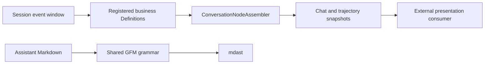

# TUI presentation exports

The machine-readable owner and verification map is [`tui-presentation-exports.json`](tui-presentation-exports.json).

The DSH packages own event pairing, retry and failure projection, workflow and trajectory projection, tool presentation, and Markdown parsing. External clients consume published package subpaths; they do not import `src/*`, mount the Web client object layer, or derive control state from projection values.

The presentation artifacts must load under plain Node without React, React DOM, browser globals, or CSS imports. Package exports, declaration symbols, runtime symbols, module ownership, and the built import graph are checked by `pnpm run verify-tui-presentation-exports` in artifact-consuming CI lanes.

The feature changes no Session event, protocol, runtime mutation, or browser rendering behavior. Registry publication and an out-of-tree TUI runtime remain separate release steps.
